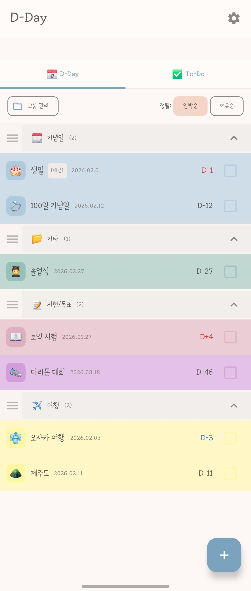
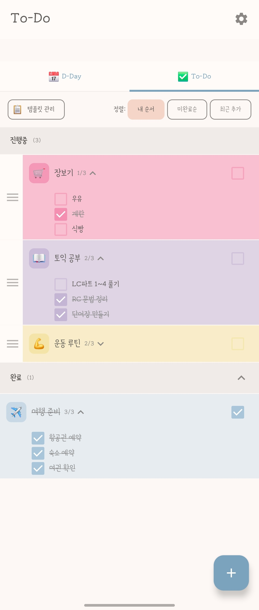
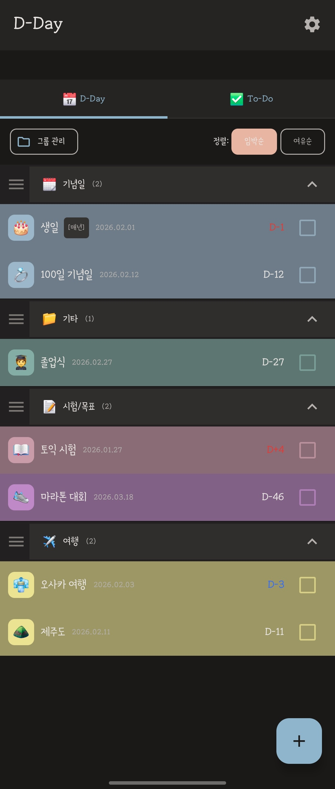
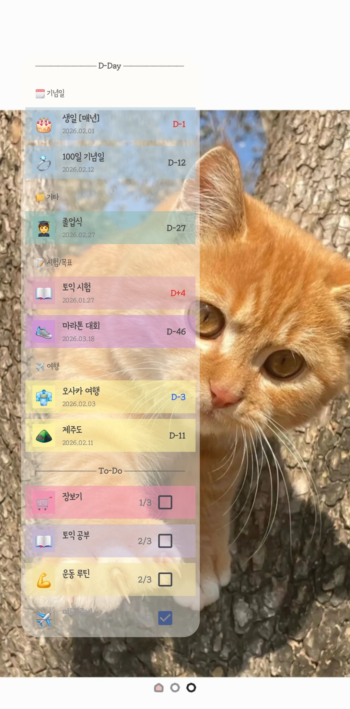
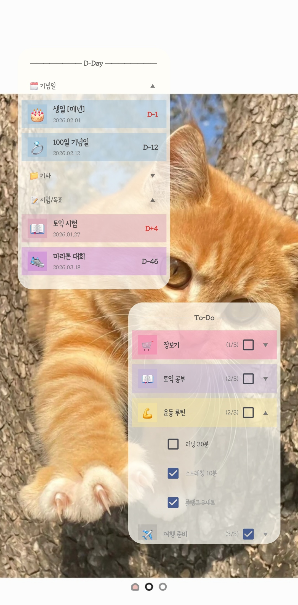
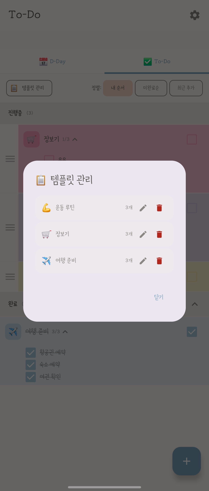

<div align="center">

[English](README.md) | **한국어**

# 📅 Dayli

**D-Day 카운트다운 & To-Do 체크리스트 — 홈 화면에서 항상 확인하세요**

*잊지 않으려면, 항상 보이게.*

[](https://developer.android.com)
[](https://kotlinlang.org)
[](https://developer.android.com/jetpack/compose)

</div>

---

## 📱 스크린샷

<div align="center">
<table>
  <tr>
    <td align="center"><b>D-Day 탭</b></td>
    <td align="center"><b>To-Do 탭</b></td>
    <td align="center"><b>다크 모드</b></td>
  </tr>
  <tr>
    <td></td>
    <td></td>
    <td></td>
  </tr>
  <tr>
    <td align="center"><b>혼합 위젯</b></td>
    <td align="center"><b>개별 위젯</b></td>
    <td align="center"><b>템플릿 관리</b></td>
  </tr>
  <tr>
    <td></td>
    <td></td>
    <td></td>
  </tr>
</table>
</div>

---

## ✨ 주요 기능

### D-Day 카운트다운
- 중요한 날짜를 등록하고 남은 일수 확인
- 그룹별 분류로 깔끔하게 정리
- 임박순/여유순 정렬
- 매년 반복 설정
- D-1, D-Day 푸시 알림

### To-Do 체크리스트
- 하위 항목까지 세분화해서 관리
- 템플릿 저장 & 불러오기
- 진행률 한눈에 확인 (2/5 등)
- 내 순서 / 미완료순 / 최근 추가 정렬

### 홈 화면 위젯
- **혼합 위젯** — D-Day와 To-Do를 함께 표시
- **D-Day 전용 위젯** — 날짜 추적에 집중
- **To-Do 전용 위젯** — 빠른 할 일 체크
- 위젯에서 바로 체크 가능
- 그룹 접기/펼치기 지원
- 글씨 크기, 배경 투명도 커스터마이징

### 커스터마이징
- 시스템 이모지 전체 사용 가능
- 14가지 파스텔 색상 팔레트
- 다크모드 지원
- 앱 & 위젯 글씨 크기 조절 (작게 / 보통 / 크게)
- 아이템/아이콘 배경 투명도 설정

---

## 🛠 기술 스택

| 분류 | 기술 |
|------|------|
| **언어** | Kotlin |
| **UI 프레임워크** | Jetpack Compose |
| **아키텍처** | MVVM |
| **로컬 DB** | Room |
| **위젯** | RemoteViews + AppWidgetProvider |
| **비동기 처리** | Kotlin Coroutines + Flow |
| **DI** | Manual dependency injection |
| **Min SDK** | 26 (Android 8.0) |
| **Target SDK** | 35 (Android 15) |

---

## 🏗 아키텍처

```
com.silverwest.dayli
├── data/
│   ├── database/          # Room DB, DAO, Entity
│   ├── repository/        # 데이터 레포지토리
│   └── model/             # 데이터 모델
├── ui/
│   ├── dday/              # D-Day 탭 화면 & 컴포넌트
│   ├── todo/              # To-Do 탭 화면 & 컴포넌트
│   ├── settings/          # 설정 화면
│   └── theme/             # 앱 테마 (색상, 타이포그래피)
├── widget/
│   ├── mixed/             # 혼합 위젯 (D-Day + To-Do)
│   ├── dday/              # D-Day 전용 위젯
│   └── todo/              # To-Do 전용 위젯
└── notification/          # D-Day 알림
```

**MVVM 패턴**을 따르며 UI, 비즈니스 로직, 데이터 계층을 명확히 분리했습니다. Room 데이터베이스로 로컬 데이터를 관리하고, Kotlin Flow로 앱과 위젯 간 반응형 데이터 업데이트를 구현했습니다.

---

## 🔑 주요 기술적 도전

### 위젯 ↔ 앱 양방향 동기화
앱과 홈 화면 위젯 간 양방향 동기화를 구현했습니다. 앱에서의 변경이 위젯에 즉시 반영되고, 위젯에서의 체크박스 조작이 `AppWidgetManager.notifyAppWidgetViewDataChanged()`를 통해 실시간으로 앱 데이터베이스에 반영됩니다.

### 위젯 내 접기/펼치기 그룹
`RemoteViews`는 Compose에 비해 레이아웃 기능이 제한적이지만, 그 안에서 커스텀 접기/펼치기 그룹 헤더를 구현했습니다. 위젯 업데이트 간에도 펼침/접힘 상태가 유지되도록 관리했습니다.

### 시스템 이모지 피커 통합
`androidx.emoji2:emoji2-emojipicker`를 활용하여 성별 및 피부색 변형을 포함한 모든 시스템 이모지에 접근할 수 있도록 구현했습니다.

### 템플릿 시스템
자주 사용하는 체크리스트 구조를 저장하고 한 번의 탭으로 빠르게 재생성할 수 있는 To-Do 템플릿 저장/불러오기 시스템을 설계했습니다.

---

## 📦 빌드 & 실행

```bash
# 레포지토리 클론
git clone https://github.com/esheo1787/Dayli.git

# Android Studio에서 열기
# 에뮬레이터 또는 실기기에서 빌드 및 실행 (min SDK 26)
```

**요구사항:**
- Android Studio Ladybug 이상
- JDK 17+
- Android SDK 35

---

## 🗺 로드맵

- [x] D-Day & To-Do 핵심 기능
- [x] 홈 화면 위젯 (혼합, D-Day, To-Do)
- [x] 다크모드
- [x] 시스템 이모지 피커
- [x] 템플릿 시스템
- [ ] Google Play 스토어 출시
- [ ] 테마 팩 (Clean, Mono)
- [ ] 배너 광고 연동
- [ ] 캘린더 연동
- [ ] 시간 기반 스케줄링
- [ ] 클라우드 백업 & 동기화

---

## 📄 개인정보처리방침

Dayli는 개인정보를 수집하지 않습니다. 모든 데이터는 사용자의 기기에만 저장됩니다.

[개인정보처리방침 보기](https://esheo1787.github.io/Dayli/privacy-policy.html)

---

## 📬 연락처

- **개발자:** silverwest
- **이메일:** heunseo1787@gmail.com

---

<div align="center">

Made with 💛 by silverwest

</div>
