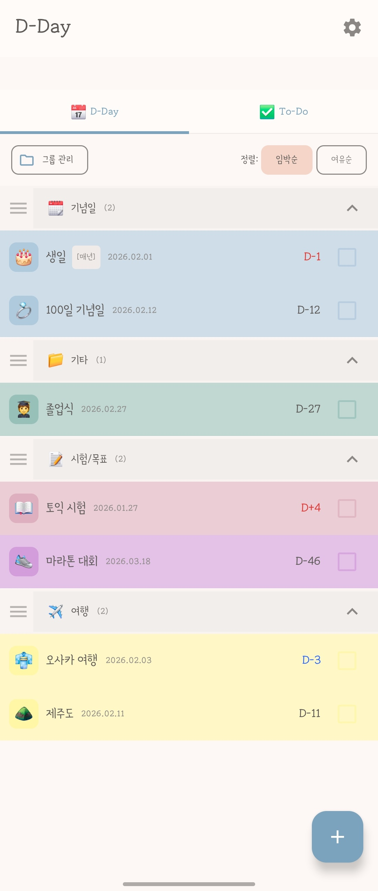
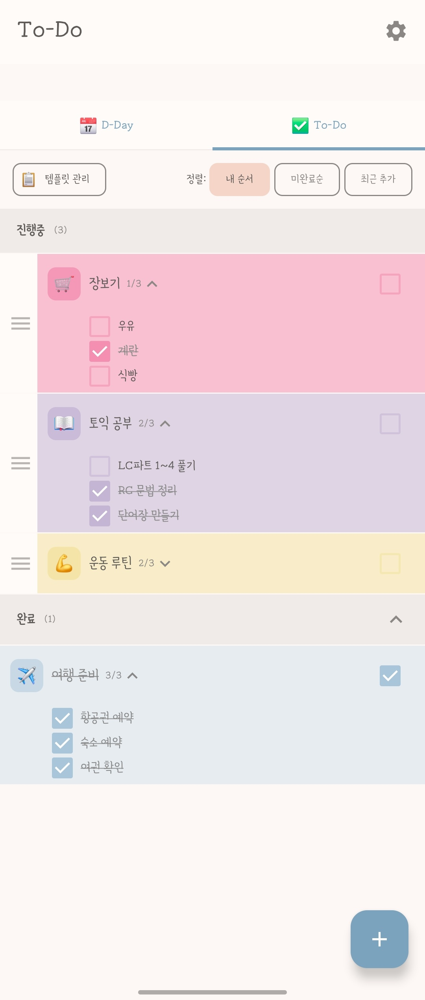
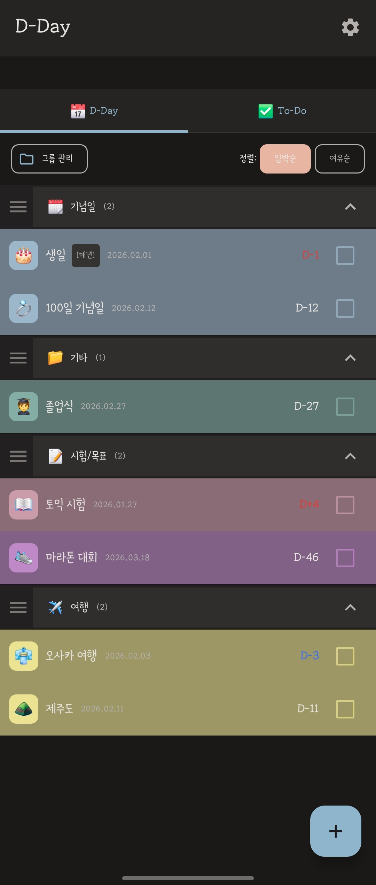
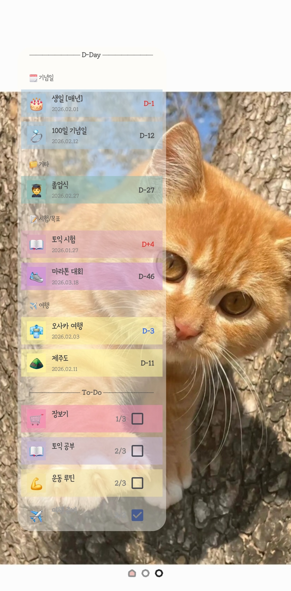
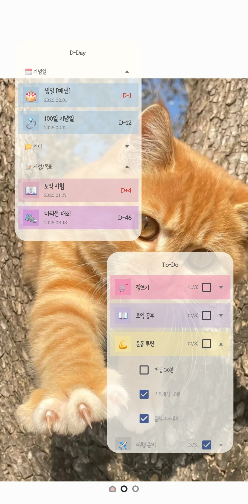
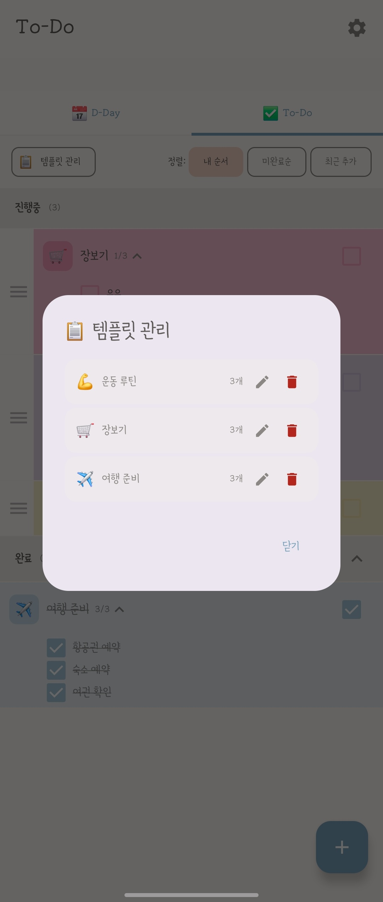

<div align="center">

**English** | [한국어](README.ko.md)

# 📅 Dayli

**D-Day Countdown & To-Do Checklist — Always Visible on Your Home Screen**

*Keep your important dates and daily tasks in sight, not out of mind.*

[](https://developer.android.com)
[](https://kotlinlang.org)
[](https://developer.android.com/jetpack/compose)

[](https://play.google.com/store/apps/details?id=com.silverwest.dayli)

</div>

---

## 📱 Screenshots

<div align="center">
<table>
  <tr>
    <td align="center"><b>D-Day Tab</b></td>
    <td align="center"><b>To-Do Tab</b></td>
    <td align="center"><b>Dark Mode</b></td>
  </tr>
  <tr>
    <td></td>
    <td></td>
    <td></td>
  </tr>
  <tr>
    <td align="center"><b>Mixed Widget</b></td>
    <td align="center"><b>Separate Widgets</b></td>
    <td align="center"><b>Template Manager</b></td>
  </tr>
  <tr>
    <td></td>
    <td></td>
    <td></td>
  </tr>
</table>
</div>

---

## ✨ Features

### D-Day Countdown
- Track important dates with countdown/count-up display (D-3, D-2 in blue / D-1, D-Day, D+N in red)
- Time scheduling (e.g., 2:30 PM)
- Memo field for location, notes, and additional context
- Organize with custom groups, drag to reorder groups
- Group management: rename, delete, custom emoji per group
- Sort by upcoming or furthest dates
- Recurring schedules: daily, weekly (with day selection), monthly, yearly
- Advance display setting (show items days/weeks before due date)
- Checked repeat items auto-hide and reappear on next occurrence
- Calendar view for monthly D-Day overview

### Per-Item Notifications
- Custom notification rules per item
- Day-based: 1 / 3 / 7 / 14 / 30 days before
- Time-based: 10 / 30 min, 1 / 2 hours before (when time is set)
- Global D-1 and D-Day push notifications (configurable time, sound, vibration)

### AI Auto-Input
- Auto-extract events from text input or gallery images
- Natural language parsing powered by Google Gemini 2.5 Flash
- Korean OCR via ML Kit text recognition
- Supports exam schedules, recipes, shopping lists, appointments, and more
- Batch creation of multiple events at once
- Context-aware emoji recommendations

### To-Do Checklist
- Sub-checklist items for detailed task breakdown
- Automatic completion when all sub-items are checked
- Save & load templates for recurring tasks
- Progress tracking (e.g., 2/5 completed)
- Drag to reorder items
- Multiple sort options: custom order, incomplete first, recently added
- Recurring schedules: daily, weekly (with day selection), monthly, yearly

### Share & Export
- Text sharing with emoji + D-Day countdown format
- Image sharing with color card-style PNG generation
- Bundle D-Days by date for sharing
- To-Do sharing includes progress bar

### Home Screen Widgets
- **Mixed Widget** — D-Day and To-Do combined
- **D-Day Only Widget** — Focused date tracking
- **To-Do Only Widget** — Quick task checking
- Check off tasks directly from widgets
- Collapsible groups for space efficiency
- Customizable text size and background opacity

### Customization
- Full system emoji picker for icons
- 14 distinct pastel color palette
- Theme modes: System default / Light / Dark
- App & widget text size adjustment (Small / Default / Large)
- Item background, icon background, and widget background opacity controls
- Pull-to-refresh on both tabs
- UI state persistence: last tab, section expand/collapse, sub-checklist expand state

---

## 🛠 Tech Stack

| Category | Technology |
|----------|-----------|
| **Language** | Kotlin |
| **UI Framework** | Jetpack Compose |
| **Architecture** | MVVM |
| **Local Database** | Room |
| **Widgets** | RemoteViews + AppWidgetProvider |
| **Async** | Kotlin Coroutines + LiveData |
| **AI** | Google Gemini 2.5 Flash |
| **OCR** | ML Kit (Korean Text Recognition) |
| **Ads** | Google AdMob |
| **Min SDK** | 24 (Android 7.0) |
| **Target SDK** | 35 (Android 15) |

---

## 🏗 Architecture

```
com.silverwest.dayli
├── MainActivity.kt                  # App entry point
├── ui/theme/                        # App theming (Color, Theme, Type)
└── ddaywidget/
    ├── DdayScreen.kt               # Main screen (D-Day + To-Do tabs)
    ├── DdayListItem.kt             # List item composable
    ├── AddEditBottomSheet.kt       # Add/edit bottom sheet
    ├── SettingsScreen.kt           # Settings screen
    ├── DdayItem.kt                 # Room entity
    ├── DdayDao.kt                  # Room DAO
    ├── DdayDatabase.kt             # Room database (v15, 15 migrations)
    ├── DdayViewModel.kt            # ViewModel
    ├── DdaySettings.kt             # SharedPreferences helper
    ├── DdayWidgetProvider.kt       # Mixed widget provider
    ├── DdayOnlyWidgetProvider.kt   # D-Day only widget provider
    ├── TodoOnlyWidgetProvider.kt   # To-Do only widget provider
    ├── NotificationHelper.kt       # Notification channel & delivery
    ├── NotificationScheduler.kt    # Alarm scheduling
    ├── NotificationReceiver.kt     # Broadcast receiver
    ├── BootReceiver.kt             # Boot alarm rescheduling
    ├── GeminiParser.kt              # Gemini AI parsing wrapper
    ├── DdayCalendarView.kt         # Calendar view
    ├── DdayShareHelper.kt          # Share (text/image)
    ├── EmojiPickerDialog.kt        # System emoji picker
    ├── TodoTemplate.kt             # Template entity & DAO
    └── ...                         # Enums, converters, utilities
```

The app follows the **MVVM pattern** with ViewModel accessing Room DAO directly. Room database handles all local persistence, and LiveData provides reactive data updates across the app and widgets.

---

## 🔑 Key Technical Challenges

### Widget ↔ App Synchronization
Implemented bidirectional sync between the app and home screen widgets. Changes in the app instantly reflect on widgets, and checkbox interactions on widgets update the app's database in real-time using `AppWidgetManager.notifyAppWidgetViewDataChanged()`.

### Collapsible Group Sections in Widgets
Built custom collapsible/expandable group headers within `RemoteViews`, which has limited layout capabilities compared to Compose. Managed expand/collapse state persistence across widget updates.

### Full Emoji Picker Integration
Integrated `androidx.emoji2:emoji2-emojipicker` to provide access to all system emojis including gender and skin tone variants, replacing a limited custom emoji grid.

### Template System
Designed a template save/load system for To-Do items, allowing users to store frequently used checklist structures and quickly recreate them with a single tap.

### AI Natural Language Parsing (Gemini + ML Kit)
Combined Google Gemini 2.5 Flash API with ML Kit Korean OCR to auto-extract events from natural language and images. Applied context-optimized prompt engineering: exam schedules grouped by time slot, recipes with ingredients as sub-tasks, shopping lists with product-only extraction, and more.

### Image Share Card Generation
Built a feature to render D-Day and To-Do items as card-style PNG images for sharing. Uses Canvas API to draw rounded corners, auto-adjusted text color based on background brightness, and progress bars for To-Do items.

---

## 📦 Build & Run

```bash
# Clone the repository
git clone https://github.com/esheo1787/Dayli.git

# Open in Android Studio
# Build and run on emulator or device (min SDK 24)
```

**Requirements:**
- Android Studio Ladybug or later
- JDK 17+
- Android SDK 35

---

## 🗺 Roadmap

- [x] Core D-Day & To-Do functionality
- [x] Home screen widgets (Mixed, D-Day, To-Do)
- [x] Dark mode & theme selection
- [x] Full emoji picker
- [x] Template system
- [x] Recurring schedules (daily, weekly, monthly, yearly)
- [x] Group management & drag reorder
- [x] Push notifications with customizable settings
- [x] Per-item notification rules
- [x] Time scheduling & memo field
- [x] AI auto-input (Gemini + ML Kit OCR)
- [x] Calendar view
- [x] Text & image sharing
- [x] Banner ad integration (AdMob)
- [x] Google Play Store release
- [ ] Theme packs (Clean, Mono)
- [ ] Cloud backup & sync

---

## 📄 Privacy Policy

Dayli stores all data locally on your device. The AI auto-input feature uses Google Gemini API and ML Kit for text processing only — no personal data is stored on external servers.

[View Privacy Policy](https://esheo1787.github.io/Dayli/privacy-policy.html)

---

## 📬 Contact

- **Developer:** silverwest
- **Email:** heunseo1787@gmail.com

---

<div align="center">

Made with 💛 by silverwest

</div>
